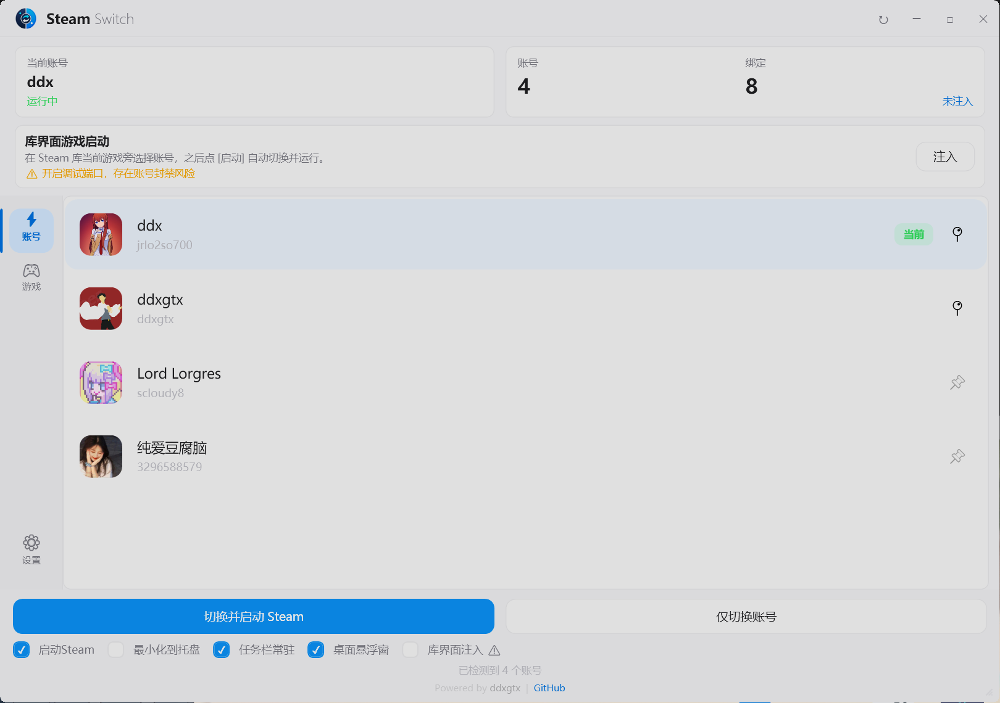
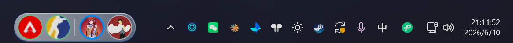
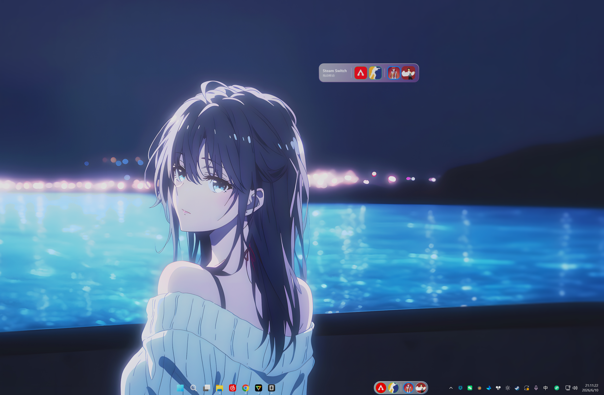
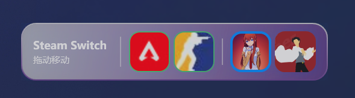
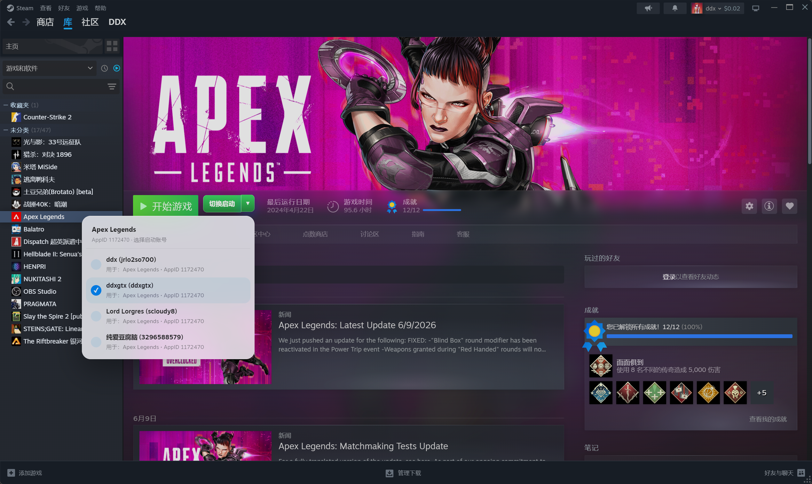

<div align="center">


# Steam Switch

**一站式 Steam 多账号管理工具**

快速切换账号 · 游戏账号绑定 · 任务栏常驻 · 桌面悬浮窗 · Steam 库注入

[](LICENSE)
[](https://dotnet.microsoft.com/)
[]()
[](https://github.com/ddxgtx/SteamSwitch/releases)
[]()

</div>

---

<div align="center">

### 主界面


### 游戏绑定


### 设置与快捷入口


### 系统托盘


### Steam 库界面注入


</div>

---

## 功能特性

<table>
<tr>
<td width="50%">

### 账号切换
- 自动读取 Steam 本机登录账号、昵称、头像
- 支持「切换并启动 Steam」与「仅切换账号」
- 系统托盘菜单快速切换
- 最小化到托盘，支持开机自启

</td>
<td width="50%">

### 游戏绑定与启动
- 扫描本机已安装 Steam 游戏
- 为游戏绑定默认启动账号
- 固定常用游戏到任务栏/悬浮窗
- 启动前二次确认，避免误操作

</td>
</tr>
<tr>
<td width="50%">

### 任务栏常驻
- 将账号和游戏嵌入 Windows 任务栏
- 支持自动/左侧/中间/右侧定位
- 液态玻璃效果、圆角模式
- 右键快捷菜单

</td>
<td width="50%">

### 桌面悬浮窗
- 可拖动的账号和游戏快捷入口
- 始终置顶、锁定位置、透明度调节
- 6 种玻璃颜色、液态玻璃效果
- 不出现在 Alt+Tab 中

</td>
</tr>
<tr>
<td width="50%">

### Steam 库界面注入
- 在游戏详情页注入「切换启动」按钮
- 点击直接使用绑定账号启动
- 下拉箭头选择切换账号
- 绑定后按钮变为绿色标识

</td>
<td width="50%">

### 设置与主题
- 暗黑/白色主题切换
- 设置自动保存（500ms 防抖）
- 日志按日期轮转
- 一键重置布局

</td>
</tr>
</table>

---

## 安装

### 方式一：安装程序（推荐）

1. 下载 [SteamSwitch-v2.4.0-win-x64-setup.exe](https://github.com/ddxgtx/SteamSwitch/releases/download/v2.4.0/SteamSwitch-v2.4.0-win-x64-setup.exe)
2. 运行安装程序，支持中文界面
3. 可选创建桌面快捷方式、开机自启

### 方式二：便携版

1. 下载 [SteamSwitch-v2.4.0-win-x64-portable.zip](https://github.com/ddxgtx/SteamSwitch/releases/download/v2.4.0/SteamSwitch-v2.4.0-win-x64-portable.zip)
2. 解压到任意目录
3. 运行 `SteamSwitch.exe`

### 从源码构建

```powershell
git clone https://github.com/ddxgtx/SteamSwitch.git
cd SteamSwitch
dotnet build SteamSwitch.sln -c Release
```

或直接运行 `build.bat`

---

## 系统要求

| 要求 | 说明 |
|------|------|
| 操作系统 | Windows 10 / Windows 11 (64-bit) |
| 运行时 | .NET 8.0 Desktop Runtime（便携版已内置） |
| 前置条件 | 已安装 Steam 客户端 |

---

## 使用指南

### 快速开始

```
启动 Steam Switch → 选择账号 → 点击「切换并启动 Steam」
```

### 绑定游戏账号

1. 打开「游戏」页 → 扫描本机游戏
2. 选择游戏 → 选择默认账号 → 点击绑定
3. 固定到快捷入口 → 一键启动

### Steam 库注入

1. 进入「设置」页 → 开启「Steam 库界面注入」
2. 打开 Steam 库 → 选择游戏
3. 在「开始游戏」旁看到「切换启动」按钮
4. 点击下拉箭头 → 选择账号 → 自动绑定并启动

### 任务栏/悬浮窗

1. 至少固定一个账号或游戏
2. 在设置页开启「任务栏常驻」或「桌面悬浮窗」
3. 调整位置、样式、效果

---

## 配置目录

程序数据保存在：

```
%APPDATA%\SteamSwitch
```

| 文件 | 说明 |
|------|------|
| `settings.json` | 应用设置、主题、布局配置 |
| `gamebindings.json` | 游戏与账号绑定关系 |
| `logs/steamswitch-YYYYMMDD.log` | 运行日志 |

在设置页的「维护与排障」中可快速打开目录或重置布局。

---

## 风险提示

> **Steam Switch 是第三方开源工具，与 Valve Corporation 无关联。**

- 「Steam 库界面注入」会开启 Steam CEF 调试端口
- 可能不符合 Steam 用户协议或未来平台策略
- **不用于**作弊、绕过 DRM、篡改游戏进程
- 不建议在 VAC/竞技游戏运行期间开启注入
- 如不能接受风险，请关闭注入功能，仅使用外部快捷入口

---

## 技术栈

| 技术 | 用途 |
|------|------|
| .NET 8.0 / WPF | 框架与 UI |
| CommunityToolkit.Mvvm | MVVM 架构 |
| Hardcodet.NotifyIcon.Wpf | 系统托盘 |
| Win32 API | 任务栏嵌入 |
| Steam CEF DevTools | 库界面注入（可选） |
| VDF 解析 | Steam 配置读取 |

---

## 贡献

欢迎提交 Issue 和 Pull Request！

```powershell
git checkout -b feature/your-feature
dotnet build SteamSwitch.sln -c Release
```

提交前请确认项目可以成功构建。

---

## 许可证

[MIT License](LICENSE) © [ddxgtx](https://github.com/ddxgtx)

---

## 致谢

- [Steam](https://store.steampowered.com/)
- [CommunityToolkit.Mvvm](https://github.com/CommunityToolkit/dotnet)
- [Hardcodet.NotifyIcon.Wpf](https://github.com/hardcodet/wpf-notifyicon)

---

<div align="center">

**[下载](https://github.com/ddxgtx/SteamSwitch/releases)** · **[问题反馈](https://github.com/ddxgtx/SteamSwitch/issues)** · **[功能建议](https://github.com/ddxgtx/SteamSwitch/discussions)**

如果觉得有用，请给个 Star 支持一下！

</div>
